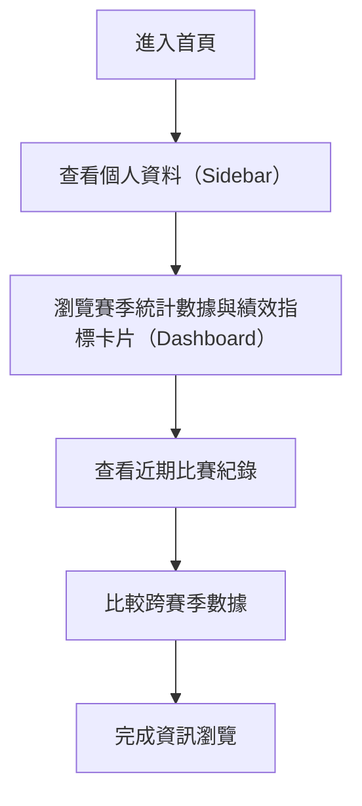

## 1. 文檔信息
- 版本：v1.0
- 編寫日期：2024-06-09
- 分發對象：產品經理、開發團隊、UI/UX 設計師、測試人員

## 2. 項目概述
### 描述
本專案為一個「運動員個人績效儀表板」Web 應用，聚焦於展示球員（Ethan）的個人資料、賽季統計數據與比賽紀錄，並以現代化、響應式設計呈現。

### 業務目標
- 提供運動員個人品牌展示平台
- 讓用戶（球員本人、教練、球迷）快速掌握球員表現
- 支援多裝置瀏覽，提升專業形象

### 用戶群體
- 運動員本人
- 教練/球隊管理者
- 球迷/潛在贊助商

## 2.4 業務流程流程圖

以下為本專案主要業務流程圖：

> 如需複製原始碼，請直接複製上方區塊內容。

## 3. 功能需求
### 核心功能
- 個人資料展示（頭像、姓名、角色）
- 賽季統計數據（進球、助攻、平均上場時間等）
- 近期比賽紀錄（對手、數據摘要）
- 賽季績效指標卡片（每場得分、助攻、籃板、出賽場次）
- 賽季比較表（跨年度數據對比）

### 次要功能
- 響應式設計，適配桌機、平板、手機
- 主題色彩自動切換（根據系統偏好）
- SEO 友善 meta 標籤與 favicon

### 使用者故事 / 使用場景
- 作為球員，我希望能在一個頁面看到我的個人資料與最新表現。
- 作為教練，我希望能快速比較球員不同賽季的數據。
- 作為球迷，我希望能了解偶像的近期比賽紀錄與總體表現。

## 4. 用戶界面需求
- 主要分為 Sidebar（個人資料＋統計）與 Dashboard（數據卡片＋比較表）
- 介面風格現代、深色主題，字體使用 Lexend
- 具體原型可參考 Figma 設計（Stitch Design Frame）
- 主要流程：進入首頁 → 查看個人資料 → 瀏覽統計卡片 → 查看賽季比較

## 5. 系統需求
- 架構：Next.js 14（App Router）、React 18
- 技術棧：TypeScript、CSS Modules、Google Fonts、ImageMagick（favicon 生成）
- 外部整合：Figma（設計來源）、靜態資源（public/）

## 6. 數據需求
- 前端靜態資料（暫無 API 串接）
- 資料模型：
  - User: { name, role, avatar }
  - Stats: { goals, assists, playtime }
  - Match: { stats, opponent }
  - SeasonMetrics: { label, value, change, changeType }
  - SeasonComparison: { season, points, assists, rebounds, games }
- 資料儲存：靜態硬編碼於元件內

## 7. 非功能性需求
- 響應式設計：支援 320px~1920px 螢幕
- 性能：首頁加載 < 1s（本地測試）
- 安全性：無登入，僅公開展示
- 可維護性：元件化、樣式模組化
- 可擴展性：可未來串接 API 或多用戶

## 8. 實施計劃
- 里程碑：
  1. Figma 設計完成
  2. 靜態頁面開發
  3. 響應式與主題優化
  4. favicon 與 SEO meta 完善
  5. 測試與上線
- 優先級：核心展示 > 響應式 > SEO > 美化
- 測試計畫：手動瀏覽器測試（桌機、手機）、Lighthouse 分析

## 9. 術語表
| 名詞             | 定義                                 |
|------------------|--------------------------------------|
| Dashboard        | 儀表板，主數據展示區                 |
| Sidebar          | 側邊欄，個人資料與統計               |
| Metric Card      | 單一績效指標卡片                     |
| Season Comparison| 跨賽季數據對比表                     |
| Favicon          | 瀏覽器分頁小圖示                     |
| Figma            | UI/UX 設計工具                       |

## 10. 簽署確認
- 審批人：產品經理 XXX
- 日期：2024-06-09

---

### 自我檢查清單
- [x] 追溯所有功能與程式碼現況一致
- [x] 各章節資訊完整，無臆測未實作功能
- [x] 非功能性需求有量化指標
- [x] 專有名詞皆有定義
- [x] UI/UX 需求與 Figma 設計對齊 